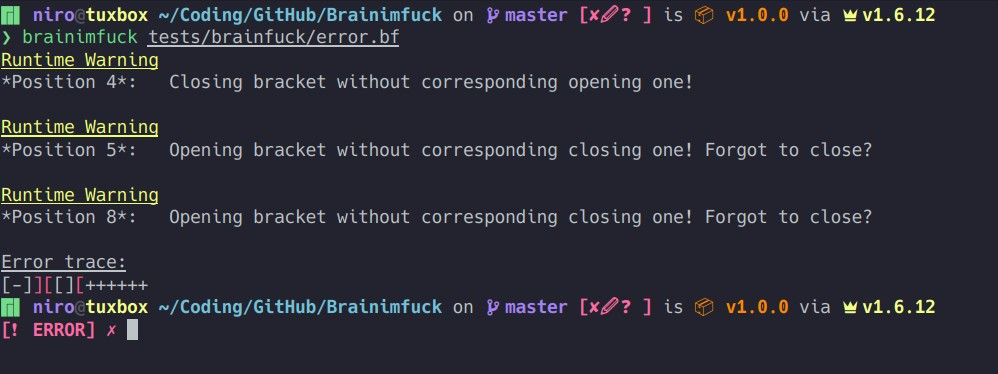

# Brainimfuck

## About

Brainimfuck is a [Brainfuck](https://wikipedia.org/wiki/Brainfuck) interpreter written in Nim. It has some advanced features, such as syntax checking and highlighting errors (if any are encountered).

## Installation

Nimble:

`nimble install brainimfuck` (not yet added in repo)

Manually:

`git clone https://github.com/nirokay/brainimfuck && cd brainimfuck && nimble install`

**Note:**

Make sure your nimble binary directory (default on unix: `~/.nimble/bin/`) is in your path!

## Features

### Syntax checks

The interpreter will detect syntax errors such as lone brackets before attempting to execute your brainfuck code.



### Flags

You can run `brainimfuck -h` or `brainimfuck --help` for a list of all operations:

```bash
-h, --help                    Displays this help message.
-v, --version                 Prints version number.
-s, --stats                   Prints statistics about runtime at the end of the execution.
-d, --debug                   Prints useful debug information.
-u, --unsafe-run              Skips syntax checking and run potentially unsafe/incorrect code.
```

#### Stats

Stats will print out information about the runtime at the end of execution.

**Example:**

```bash
$ brainimfuck -s tests/brainfuck/helloworld.bf
Hello World!

Instructions:
Execution cicles: 908
Instructions: 110

Timers:
Initialisation Time:  50 microseconds and 627 nanoseconds
Execution Time:       431 microseconds and 620 nanoseconds
---
Total time:           482 microseconds and 247 nanoseconds
```

#### Debug

This will print debug information with each instruction executed.

**Example:**

```bash
$ brainimfuck -d tests/brainfuck/helloworld.bf
---- Cicle 0 ---- 
Instruction ID: 0       Instruction: loopBracketBegin   Loop stack: {18: 37, 0: 3, 47: 49, 12: 52}
Tape pointer: 0
Current tape value: 0
Tape: {:}
---- Cicle 1 ---- 
Instruction ID: 4       Instruction: increaseTapeData   Loop stack: {18: 37, 0: 3, 47: 49, 12: 52}
Tape pointer: 0
Current tape value: 0
Tape: {:}
---- Cicle 2 ---- 
Instruction ID: 5       Instruction: increaseTapeData   Loop stack: {18: 37, 0: 3, 47: 49, 12: 52}
Tape pointer: 0
Current tape value: 1
Tape: {0: 1}
---- Cicle 3 ---- 
Instruction ID: 6       Instruction: increaseTapeData   Loop stack: {18: 37, 0: 3, 47: 49, 12: 52}
Tape pointer: 0
Current tape value: 2
Tape: {0: 2}

...
```

#### Unsafe-Run

This will not check your code for syntax errors. This will lead to a faster run time, but will not be able to output good error messages, if any errors are encountered.
